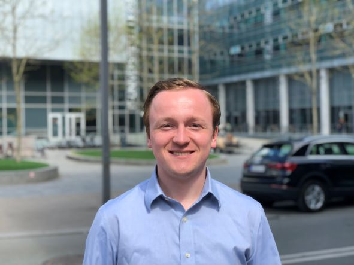

---
# Check jekyll docs
layout: page
title: 
---
Hi! I’m Jaike van Twiller, a postdoctoral researcher passionate about data-driven decision-making for a brighter future, working at the [IT University of Copenhagen](https://en.itu.dk/) in the [Data Science section](https://en.itu.dk/Research/Research-Sections/Data-Science) and part of the [Maritime Hub](https://mhub.itu.dk/).

## Research and Teaching
My research focuses on developing decision support systems using operations research and machine learning, aiming to improve operational outcomes while minimizing environmental impact. From transport and supply chain optimization to inventory and manufacturing management, I develop solutions that bridge academia and industry, turning complex challenges into actionable insights through collaborative projects. In teaching and supervision, I cover reinforcement learning in the _"Introduction to Artificial Intelligence"_ course and guide student projects ranging from realistic maritime industry problems to game-solving challenges.

## Education and Background
My academic journey began with a Bachelor of Science in Industrial Engineering at the [Amsterdam University of Applied Sciences](https://www.hva.nl/), after which I continued with a Master of Science in Operations Management and Logistics at the [Eindhoven University of Technology](https://www.tue.nl/en/). Most recently, I obtained a PhD in Artificial Intelligence and Operations Research from the [IT University of Copenhagen](https://en.itu.dk/), supervised by Associate Professor Rune Møller Jensen and Associate Professor Djordje Grbic. My [PhD Thesis](https://pure.itu.dk/en/publications/learning-and-combinatorial-optimization-for-efficient-container-v) is named _"Learning and Combinatorial Optimization for Efficient Container Vessel Stowage Planning"_, which covers how machine learning and traditional combinatorial optimization models can be used to efficiently solve a realistic yet complex planning problem in maritime logistics with global implications for the economy and environment. 
